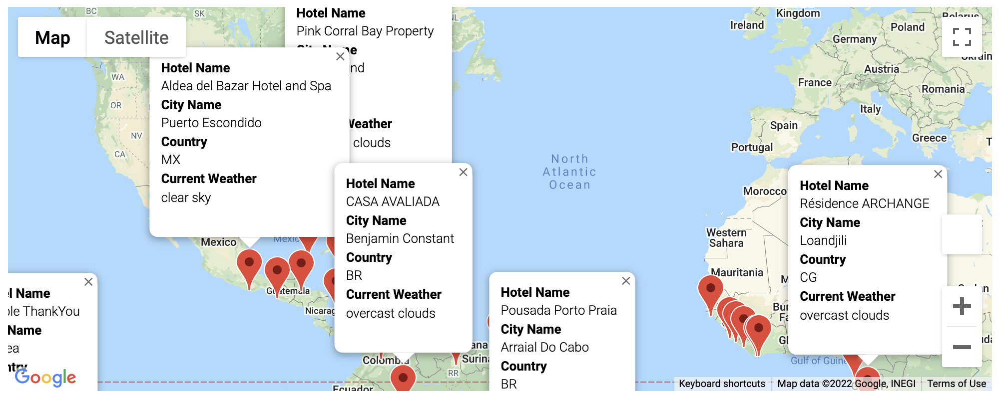
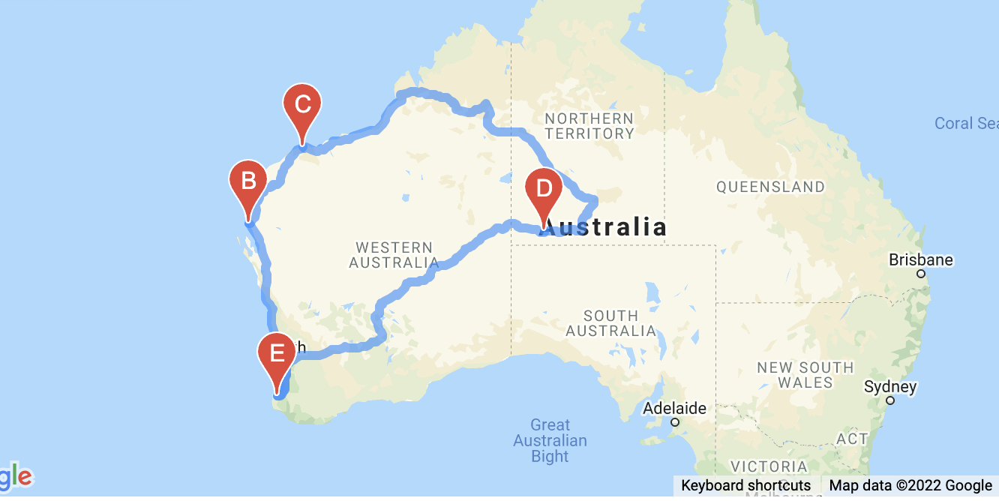

# World Weather Analysis

## Overview of the Analysis
The overall purpose of this analysis is to provide users with cities, hotel information, and a mapped route for their vacation based on their preferred temperature inputs. This is accomplished by using APIs to obtain data from Open Weather and Google to help travelers plan their vacations. This entire analysis is broken down into three parts. 

## Steps in the Analysis 
First, generated a random list of latitudes and longitudes using the 'np.random.uniform' function from numpy and created a list of coordinates. Then, we used the citipy module to find the nearest city to the coordinates we created. Since most of the earth is water, many of the coordinates we generated will not be near cities. We started with 2000 coordinates and our resulting list of cities only had about 750 cities. Once we had our final list of cities, we used the Open Weather API to generate weather information for each city on our list. We created and exported a final DataFrame containing the city, country, latitude, longitude, maximum temperature, humidity, cloudiness, wind speed, and weather current description. 

The second step in the analysis is to find cities and hotels that are within the user's minimum and maximum temperature input values. Using the 'input' function, the user specifies the minimum temperature and maximum temperature they would like for their vacation destination(s). With this information, we filtered our original list of cities and created a DataFrame of the user's preferred cities based on maximum temperature. Then using the Google Places API, we were able to determine hotels near each of the cities in the 'preferred_cities_df'. These locations and hotels were then mapped using 'gmaps'.

**This map of preferred cities shows all cities that fall within the user's temperature range**
**In this case, the user input values were between 75 - 90 F**

The third part of the analysis is to create an itinerary for the traveler. From the map we created showing the hotels in the user's preferred cities, we created a driving route travel map for four destinations. To do this, we created a separate DataFrame for each of the four cities in the itinerary. We then created a 'directions_layer' on our google map to show the route between the four cities. The route begins and ends at the same city. Finally, we also provided our user with a map showing the hotel information for each city they will be traveling to. 

**This map shows the driving travel route between the four cities the user selects**

<img src="Vacation_Itinerary/WeatherPy_travel_map_markers.png"

**This map provides user with the hotel information for each city they select**

## Results
The successful completion of this analysis brings tremendous value to the PlanMyTrip app. We were able to incorporate all of the recommendations from the beta testers. The app is now customizable to each user's temperature specifications. It also seamlessly provides the user with important information regarding their trip including a weather description, hotel information, and a travel itinerary. A future change recommendation that PlanMyTrip may want to consider is to customize the travel mode for the itinerary based on user preference. The 'directions_layer' for 'gmaps' allows for three travel modes (driving, walking, or bicycling). There may be a way to use another 'input' variable so the user can select one of these three options. 